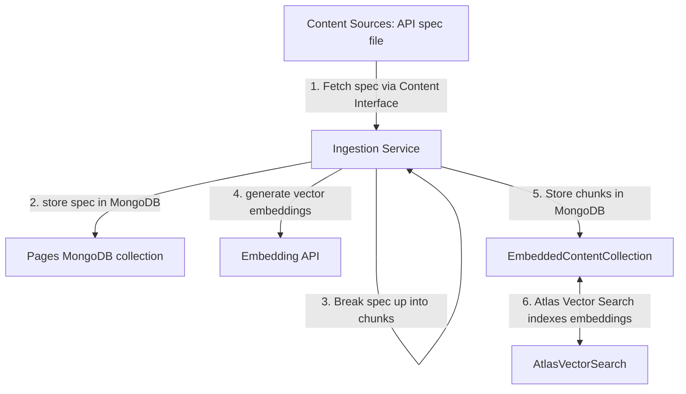
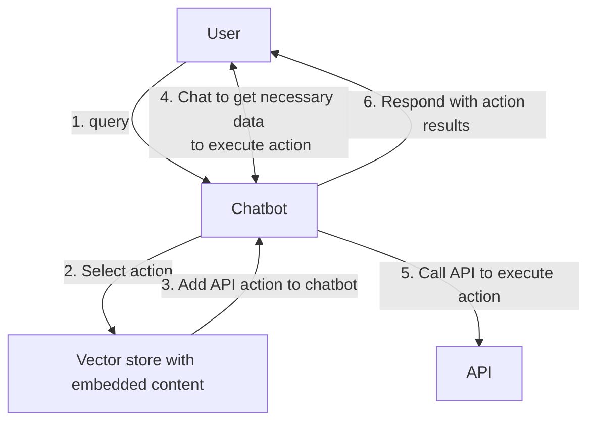

# API Chat

Chat with API using LLM + Atlas Vector Search.

For our Skunkworks, we'll work with the Atlas Admin API.

## TODOs

Stuff to do in project. As week goes on, we'll probably want to break this stuff down further.

- [ ] [INGEST] Ingest API spec files to `ApiEmbeddedContent` MongoDB collection
- [ ] [MONGODB] Set up Atlas Vector Search on `ApiEmbeddedContent` collection
- [ ] [UI] Make so can load API key, Atlas project and group before starting to chat
  - this'll make the flow work better.
  - send these with each req to server
- [ ] [INGEST] Clean up API spec so easy to consume
  - not sure if this should be part of the `pages` action, or we'll need to manually clean the spec
- [ ] [SERVER] When creating a conversation, make so can include the project and group
      in the DB.
  - api key should not be persisted in server. keep in client.
- [ ] [SERVER] add message to conversation for this functionality.
  - either respond with clarification questions for user or answer based on API call response.
  - will be similar logic to current `addMessageToConversation` route,
    but with added logic around API calls and using ChatGPT functions.

## Design

### Ingest

Very similar to chatbot.

### Chat

Similar idea to current docs chatbot, but using ChatGPT functions to load and execute actions.
Uses Atlas Vector Search to find relevant actions.

