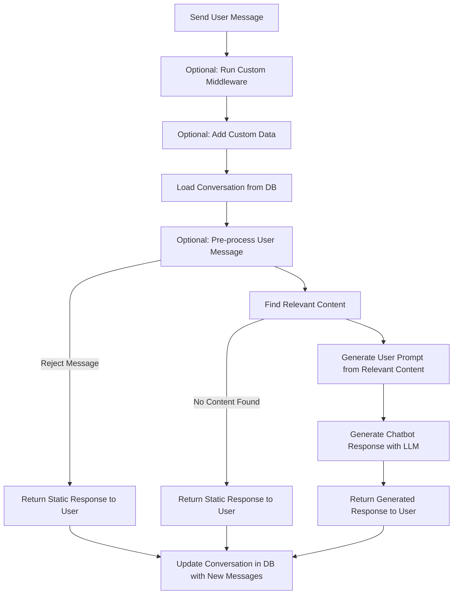

# Manage Conversations

This guide explains how the MongoDB Chatbot Server manages conversations, and the different
points where you can customize its behavior.

## Endpoints

The server has the following endpoints:

- `POST /conversations/` creates a new conversation. You must create a
  conversation before you can send messages to the chatbot.
- `POST /conversations/:conversationId/messages` sends a message to the chatbot,
  and gets a response back.
- `POST /conversations/:conversationId/messages/:messageId/rating` rates a
  message in the conversation.

For more information on these endpoints, refer to the [API Specification](openapi).

## Expose the Conversations Endpoints in Your App

The MongoDB Chatbot Server exposes the conversation endpoints at the `/conversations` path.
There are two ways that you can expose these endpoints in your app:

1. Use the [`makeApp()`](../reference/server/modules.md#makeapp)
   function to create an Express.js app. This is the easiest way to get started
   and contains everything you need out of the box.
1. Use the [`makeConversationsRouter()`](../reference/server/modules.md#makeconversationsrouter) function to create an Express.js [`Router`](https://expressjs.com/en/guide/routing.html) that you can add to an Express app.
   This is useful if you want to expose the conversation endpoints within a larger
   Express.js app or customize your server beyond what's possible with `makeApp()`.

## Add Message Flow

When you add a message to a conversation with the `POST /conversations/:conversationId/messages` endpoint, the following happens on the server:

1. (Optional) Custom Express.js middleware runs. To learn more,
   refer to the [Custom Middleware](./custom-logic#middleware) guide.
1. (Optional) Get custom data to add to the user message. To learn more,
   refer to the [Custom Data](./custom-logic#add-custom-data-to-messages) guide.
1. Load conversation from the database.
1. (Optional) The user message is preprocessed. To learn more, refer to the
   [Preprocessing](./preprocess) guide.
   a. The preprocessor can also flag if the message is rejected
   (for example if it's inappropriate). If the message is rejected,
   the server returns a static response to the user.
1. Find relevant content based on the user query. If you use the preprocessor,
   the preprocessed message is used. To learn more, refer to [Retrieve Context Information](./retrieve).
   a. If no relevant content is found, the server returns a static response to the user.
1. The relevant content is used to generate a user prompt. To learn more about
   generating the user message, refer to the [User Prompt Engineering](./llm.md#user-prompt) guide.
1. The user prompt is used to generate a chatbot response.
1. The generated response is returned to the user.
1. The conversation is updated with the new user and assistant messages.

Here's a flow chart of this process:

