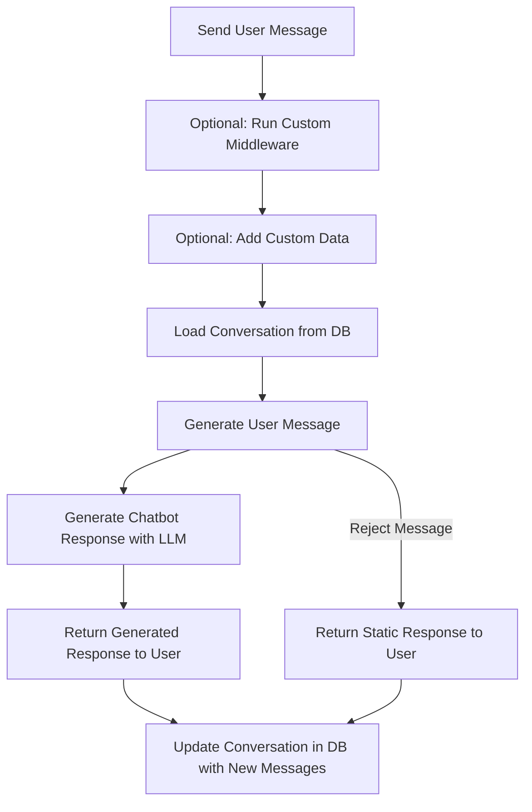

# Manage Conversations

This guide explains how the MongoDB Chatbot Server manages conversations, and the different
points where you can customize its behavior.

## Endpoints

The server has the following endpoints:

- `POST /conversations/` creates a new conversation. You must create a
  conversation before you can send messages to the chatbot.
- `POST /conversations/:conversationId/messages` sends a message to the chatbot,
  and gets a response back.
- `GET /conversations/:conversationId` gets a conversation in its current state.
- `POST /conversations/:conversationId/messages/:messageId/rating` rates an
  assistant message in the conversation.
- `POST /conversations/:conversationId/messages/:messageId/comment` adds a user
  comment to an assistant message in the conversation.

For more information on these endpoints, refer to the [API Specification](openapi).

## Security

If you do not add custom middleware that handles authentication/authorization,
a malicious actor who gets a conversation ID can modify the conversation.
You can also add custom middleware to block requests to endpoints if you do not need them in your app.

For more information about securing your server with custom middleware, refer to the [custom middleware request validation](custom-logic.md#request-validation) documentation.

## Expose the Conversations Endpoints in Your App

The MongoDB Chatbot Server exposes the conversation endpoints at the `/conversations` path.
There are two ways that you can expose these endpoints in your app:

1. Use the [`makeApp()`](../reference/server/modules.md#makeapp)
   function to create an Express.js app. This is the easiest way to get started
   and contains everything you need out of the box.
1. Use the [`makeConversationsRouter()`](../reference/server/modules.md#makeconversationsrouter) function to create an Express.js [`Router`](https://expressjs.com/en/guide/routing.html) that you can add to an Express app.
   This is useful if you want to expose the conversation endpoints within a larger
   Express.js app or customize your server beyond what's possible with `makeApp()`.

## Add Message Flow

When you add a message to a conversation with the `POST /conversations/:conversationId/messages` endpoint, the following happens on the server:

1. (Optional) Custom Express.js middleware runs. To learn more,
   refer to the [Custom Middleware](./custom-logic#middleware) guide.
1. (Optional) Get custom data to add to the user message. To learn more,
   refer to the [Custom Data](./custom-logic#add-custom-data-to-messages) guide.
1. Load conversation from the database.
1. Generate the user message. You can use this step to perform
   retrieval augmented generation (RAG), or other preprocessing of the user message.
   To learn more about generating the user message,
   refer to the [Generate User Message](./user-message.md) guide.
   1. To perform retrieval augmented generation (RAG), refer to the [RAG](./rag/index.md) guide.
1. The user prompt is used to generate a chatbot response.
1. The generated response is returned to the user.
1. The conversation is updated with the new user and assistant messages.

Here's a flow chart of this process:

