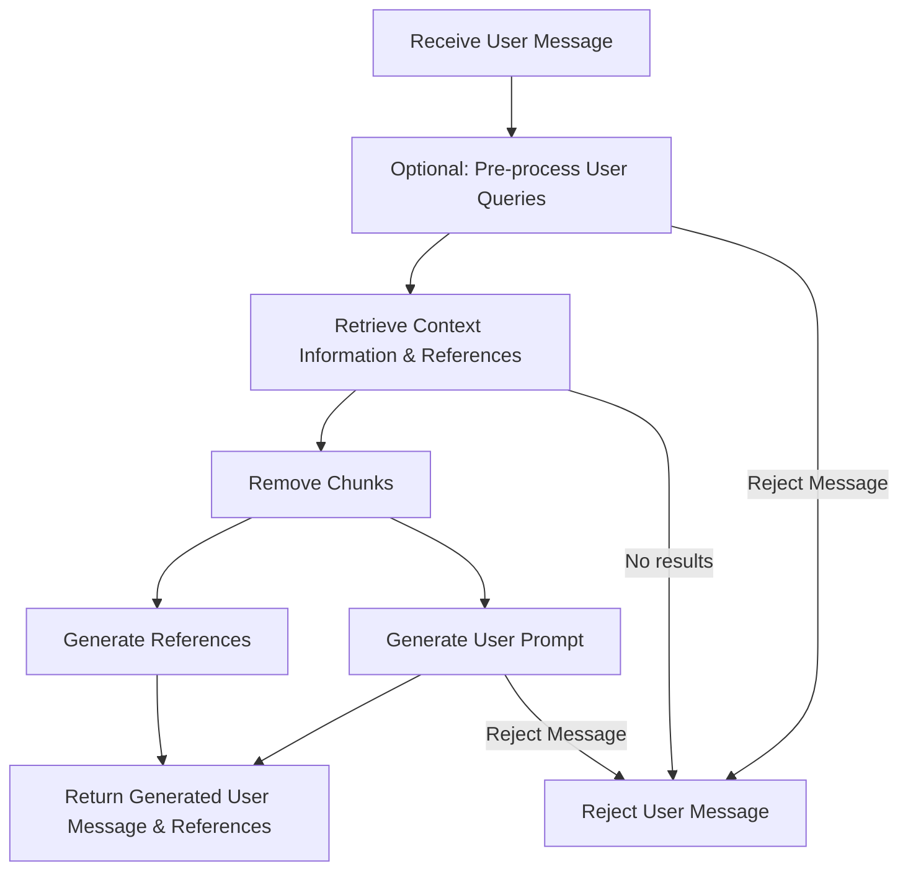

# Retrieval Augmented Generation (RAG)

You can use the MongoDB Chatbot Server to perform retrieval augmented generation (RAG).

## What is RAG?

RAG is a technique that improves chatbot response quality by grounding answers
in a knowledge base. Before a user query is sent to an LLM to generate a response,
the query is used to retrieve relevant information from a knowledge base.
The LLM responds to the user query based on the information from the knowledge base.

By grounding the response in contextual information from the knowledge base,
the chatbot can generate more relevant and accurate responses.

To learn more about RAG, refer to the article [What is Retrieval-Augmented Generation (RAG)?](https://www.mongodb.com/basics/retrieval-augmented-generation) from MongoDB.

<details>

<summary> RAG Overview Diagram </summary>


</details>

## Generate User Message with RAG

You can perform RAG in the MongoDB Chatbot Server by implementing a [`GenerateUserPromptFunc`](../../reference/server/modules.md#generateuserpromptfunc) function.

The MongoDB Chatbot Server comes with the [`makeRagGenerateUserPrompt()`](../../reference/server/modules.md#makeraggenerateuserprompt) function that you can use to perform RAG with Atlas Vector Search.

### Configure RAG

To configure the `makeRagGenerateUserPrompt()` function, include it in the
[`AppConfig.conversationsRoute.generateUserPrompt`](../../reference/server/interfaces/ConversationsRouterParams.md#generateuserprompt) property.

```ts
import {
  makeMongoDbEmbeddedContentStore,
  makeOpenAiEmbedder,
  makeMongoDbConversationsService,
  AppConfig,
  makeDefaultFindContent,
  GenerateUserPromptFunc,
  makeRagGenerateUserPrompt,
  MakeUserMessageFunc,
} from "mongodb-chatbot-server";
import { stripIndents } from "common-tags";
import { makePreprocessMongoDbUserQuery } from "./processors/makePreprocessMongoDbUserQuery";
import { AzureOpenAI } from "mongodb-rag-core/openai";

// Make preprocessor
const mongoDbUserQueryPreprocessor = makePreprocessMongoDbUserQuery({
  azureOpenAiServiceConfig: {
    apiKey: OPENAI_API_KEY,
    baseUrl: OPENAI_ENDPOINT,
    deployment: OPENAI_CHAT_COMPLETION_DEPLOYMENT,
    version: OPENAI_CHAT_COMPLETION_MODEL_VERSION,
  },
  numRetries: 0,
  retryDelayMs: 5000,
});

export const embeddedContentStore = makeMongoDbEmbeddedContentStore({
  connectionUri: MONGODB_CONNECTION_URI,
  databaseName: MONGODB_DATABASE_NAME,
  searchIndex: {
    embeddingName: OPENAI_EMBEDDING_DEPLOYMENT,
  }
});
export const embedder = makeOpenAiEmbedder({
  openAiClient,
  deployment: OPENAI_EMBEDDING_DEPLOYMENT,
  backoffOptions: {
    numOfAttempts: 3,
    maxDelay: 5000,
  },
});
export const findContent = makeDefaultFindContent({
  embedder,
  store: embeddedContentStore,
  findNearestNeighborsOptions: {
    k: 5,
    path: "embedding",
    indexName: VECTOR_SEARCH_INDEX_NAME,
    minScore: 0.9,
  },
});

// Make user message
export const makeUserMessage: MakeUserMessageFunc = async function ({
  preprocessedUserMessage,
  originalUserMessage,
  content,
  queryEmbedding,
}) {
  const chunkSeparator = "~~~~~~";
  const context = content.map((c) => c.text).join(`\n${chunkSeparator}\n`);
  const contentForLlm = `Using the following information, answer the question.
Different pieces of information are separated by "${chunkSeparator}".

<Information>
${context}
<End information>

<Question>
${preprocessedUserMessage ?? originalUserMessage}
<End Question>`;
  return {
    role: "user",
    content: originalUserMessage,
    embedding: queryEmbedding,
    preprocessedContent: preprocessedUserMessage,
    contentForLlm,
  };
};

export const generateUserPrompt: GenerateUserPromptFunc =
  makeRagGenerateUserPrompt({
    queryPreprocessor: mongoDbUserQueryPreprocessor,
    findContent,
    makeReferenceLinks: makeMongoDbReferences,
    makeUserMessage,
  });

export const config: AppConfig = {
  conversationsRouterConfig: {
    generateUserPrompt,
    // ...
  },
  // ...
};
```

### Data Flow

The `makeRagGenerateUserPromptFunc()` function has the following data flow:

1. (Optional) Preprocess the user message. You can use this step to transform the
   user message before it is used to retrieve relevant content with to Atlas Vector Search.
   To learn more, refer to the [Pre-process User Queries](./preprocess.md) guide.
1. Retrieve relevant content from Atlas Vector Search. To learn more, refer to the
   [Retrieve Context Information](./retrieve.md) guide.
1. Removes any chunks that would exceed the max context tokens.
1. Generate the user prompt and references based on the retrieved content.
1. Return generated user prompt and references.

Also, you can reject the user message at any point in the flow.
When the message is rejected, the server responds with a static response.


