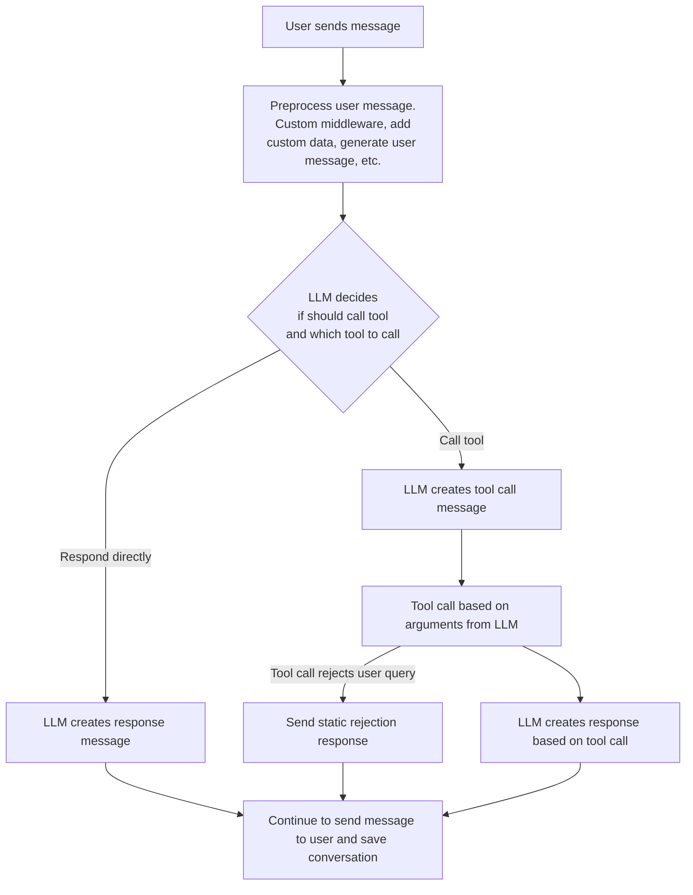

# Tool Calling

You can give your chatbot access to external tools. For example,
you could add a tool interfaces with an API and use the data returned from the API
in the chatbot.

This is a powerful feature that allows you to extend the capabilities
of your chatbot beyond retrieval augmented generation and LLM conversations.

## Tool Calling Flow

When a user sends a message to a chatbot with tool calling implemented,
the following happens:



## Define a Tool

To make a tool, define an object that implements the [`Tool`](../reference/core/interfaces/Llm.Tool.md) interface.

A tool must include a `definition` property that is a function definition for the LLM to invoke. This must be JSON schema that corresponds to the [OpenAI function definition format](https://platform.openai.com/docs/assistants/tools/function-calling).
The tool responds LLM-generated arguments that correspond to this JSON schema.

You must also include the `call()` method, which accepts the LLM-generated arguments
plus additional metadata and returns a tool call message, references,
and whether the user query should be rejected.

```ts
// weatherTool.ts

import { Tool } from "mongodb-chatbot-server";

export const weatherTool: Tool = {
  definition: {
    name: "getCurrentWeather",
    description: "Get the weather in location",
    parameters: {
      type: "object",
      properties: {
        location: {
          type: "string",
          description: "The city and state e.g. San Francisco, CA",
        },
        unit: { type: "string", enum: ["c", "f"] },
      },
      required: ["location"],
    },
  },
  async call({ functionArgs: { location, unit } }) {
    const weatherReport = await fetchWeatherFromApi(location, unit);
    return {
      toolCallMessage: {
        role: "function",
        name: "getCurrentWeather",
        content: `The weather in ${location} is: ${weatherReport.content}`,
      },
      references: [{ title: `${location} weather`, url: weatherReport.url }],
    };
  },
};
```

## Give Tools to the ChatLLM

To give the chatbot access to the tool, you must provide the [`ChatLlm`](../reference/core/interfaces/Llm.ChatLlm.md) with the tool.

The [`makeOpenAiChatLlm()`](../reference/core/namespaces/Llm.md#makeopenaichatllm)
function, which you can use to instantiate a client for an OpenAI model, takes a `tools` argument.
Provide an array of tools to the `tools` argument.

```ts
// weatherChatLlm.ts
import { makeOpenAiChatLlm, OpenAiChatMessage } from "mongodb-chatbot-server";
import { weatherTool } from "./weatherTool";

export const openAiClient = new AzureOpenAI({
  apiKey: OPENAI_API_KEY,
  endpoint: OPENAI_ENDPOINT,
  apiVersion: OPENAI_API_VERSION,
});
 

export const weatherChatLlm = makeOpenAiChatLlm({
  openAiClient,
  deployment: OPENAI_CHAT_COMPLETION_DEPLOYMENT,
  openAiLmmConfigOptions: {
    temperature: 0,
    maxTokens: 500,
  },
  tools: [weatherTool],
});
```

## Configure Server Tool Calling Behavior

To use a `ChatLlm` with tool calling in your server, add it to your configuration
as you would any other `ChatLlm`.

```ts
import { AppConfig } from "mongodb-chatbot-server";
import { weatherChatLlm } from "./weatherChatLlm";

const config: AppConfig = {
  conversationsRouterConfig: {
    llm: weatherChatLlm,
    // ...other config
  },
  // ...other config
};
```
