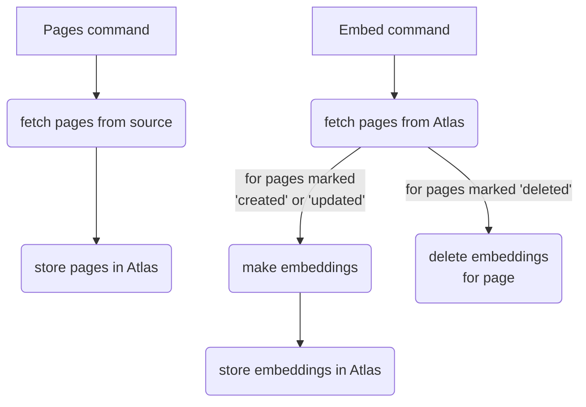

# Ingest

The ingest tool fetches pages from sources and stores the embeddings in the
database.

Based on https://github.com/cbush/typescript-cli-template

## System Overview



The ingest tool has two major commands: `pages` and `embed`. These commands
represent the two stages of ingesting content.

### Stage 1: Pages

The `pages` command fetches pages from data sources and stores them in Atlas
with a last updated timestamp. A "page" is some text with a URL. A data source
is an arbitrary collection of pages. You can create a new data source by
implementing `DataSource`.

For each given data source, the `pages` command compares the pages with those
already stored in the database and only updates those that are new, have
changed, or have been deleted. The command does not actually delete documents
from the database, but instead marks a page as "deleted", so that the next stage
knows to delete the corresponding embeddings.

### Stage 2: Embed

The `embed` command creates embeddings for pages that have been updated since a
given date. For pages that have been deleted, the command deletes any
corresponding embeddings in the database. If a page is new or has been updated,
the command regenerates the corresponding embeddings for that page.

## Development

### Build & Run

```sh
npm i
npm run build
node .
```

### Add Commands

Add commands to `src/commands/`. The CLI automatically picks up any non-test .ts
file that default-exports a `yargs.CommandModule`. See existing commands for
example.
