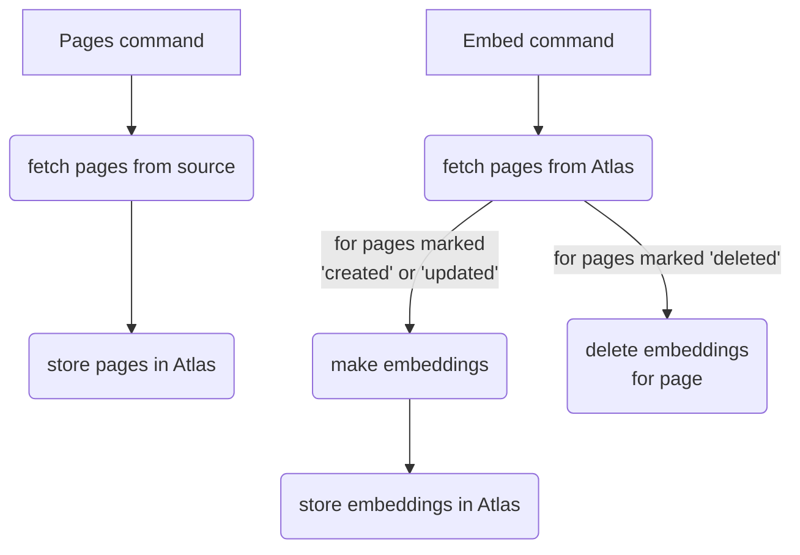

# MongoDB Ingest CLI

The MongoDB Ingest CLI ingest content into a MongoDB collection that you can use for retrieval augmented generation (RAG) applications.

You can use the Ingest CLI to ingest data into RAG applications built with the MongoDB Chatbot Framework.

## Documentation

To learn more about the MongoDB Ingest CLI, refer to the [documentation](https://mongodb.github.io/chatbot/ingest/configure).

## System Overview



The ingest tool has two major commands: `pages` and `embed`. These commands
represent the two stages of ingesting content.

### Stage 1: Pages

The `pages` command fetches pages from data sources and stores them in Atlas
with a last updated timestamp. A "page" is some text with a URL. A data source
is an arbitrary collection of pages. You can create a new data source by
implementing `DataSource`.

For each given data source, the `pages` command compares the pages with those
already stored in the database and only updates those that are new, have
changed, or have been deleted. The command does not actually delete documents
from the database, but instead marks a page as "deleted", so that the next stage
knows to delete the corresponding embeddings.

### Stage 2: Embed

The `embed` command creates embeddings for pages that have been updated since a
given date. For pages that have been deleted, the command deletes any
corresponding embeddings in the database. If a page is new or has been updated,
the command regenerates the corresponding embeddings for that page.

## Configuration

To configure the ingest tool, provide an `ingest.config.js` file. The default
export of this file must be a `Config` object. See [Config.ts](./src/Config.ts)
for details.

## Development

### Build & Run

Set up the project monorepo. Refer to the [Contributor Guide](https://github.com/mongodb/chatbot/blob/main/CONTRIBUTING.md)
for more info on monorepo setup.

Make sure you set up the `.env` files in both the `mongodb-rag-ingest` and `mongodb-rag-core` projects.

To use the ingest CLI locally, run:

```shell
# See all available commands
node .

# Run specific command
node . <command> <options>
```

A few things to keep in mind when developing in the `mongodb-rag-ingest` project:

1. You **must** recompile the `mongodb-rag-ingest` project with `npm run build` before running it
   from the CLI for changes to take effect. Therefore, when testing CLI commands locally,
   it can be convenient to run compilation and the command as a one-liner:

   ```shell
    npm run build && node . <command> <options>
   ```

2. You must also recompile `mongodb-rag-core` with `npm run build` every time you make
   changes to it for the changes to be accessible to `mongodb-rag-ingest` or any other projects that
   depend on it.

   ```shell
   cd ../mongodb-rag-core
   npm run build
   cd ../ingest
   # do stuff
   ```

### Add Commands

Add commands to `src/commands/`. The CLI automatically picks up any non-test .ts
file that default-exports a `yargs.CommandModule`. See existing commands for
example.
